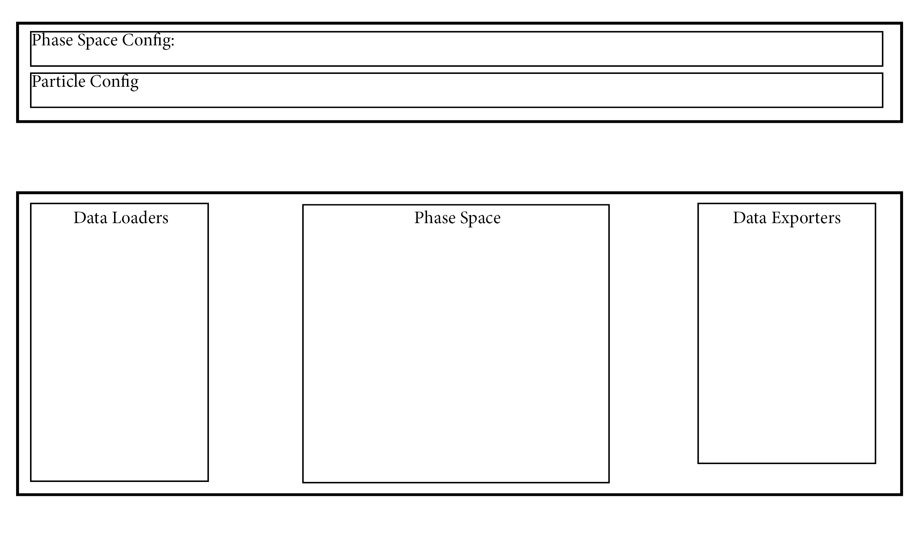

# Summary

In accelerator particle physics, a description of the positions and directions of an ensemble of particles is termed a phase space (@wiedemann_particle_2015). To describe arbitrary particles at a given time, 6 properties are required; for example, position-momentum: `[x y z px py pz]`. To extend this description to arbitrary particles at an arbitrary time and handle particles of different statistical weighr, the particle species (e.g. electron, x-ray. etc.), time at which its properties were recorded, and statistical weight of the particle must also be included. Phase space data is commonly both the input and output of particle accelerator simulations. Unfortunately, there is no widely accepted format for phase space data.

# Statement of need

Although the use of phase space data is well established, there is no consistent implementation of phase space data between different programs, as discussed at length in @tessier_proposal_2021. To appreciate why this is an issue, one must understand that in a typical accelerator workflow, it is common to utilize several different programs to simulate different phases of particle transport, and for any given simulation task, there are many different simulation programs one can use; an incomplete list is supplied in the wikipedia article @noauthor_accelerator_2022.  Each of these programs will typically utilize their own unique format for saving and loading phase space data. This means that getting these programs to 'speak' to each other is generally a substantial amount of work. In addition, the fragmented data format has led to fragmented analysis frameworks, with different fields and research groups tending to develop there own, often in-house, code for handling phase space data.

`ParticlePhaseSpace` aims to solve these issues by providing well documented, extensible mechanisms for the import and export of data in different formats, as well as a library of methods for visualizing, manipulating, characterizing and analyzing phase space data. There are many examples in the scientific literature where ParticlePhaseSpace would have been useful, for example; @st_aubin_integrated_2010, @whelan_novel_2016, lesnat_particle_2021. The basic code structure is shown in \autoref{figure 1}. 

The underlying data is stored in a pandas data frame with clearly defined allowed columns and units. Users can select from a variety of pre-defined unit sets at the data read in stage; units can also be set within the `PhaseSpace` object or at the data export stage. `PhaseSpaceConfig` define the quantities which **must** be included in in the PhaseSpaceData, as well as those which may optionally be calculated. All such quantities must have an associated method defining their calculation inside `PhaseSpace.fill`; if this method is not defined and callable the code tests will fail. The particles which are handled by this code are defined inside `ParticleConfig`. This code has been designed for extensibility: the supported particles, phase space data format, and import/export mechanisms are extensible, with [documentation](https://bwheelz36.github.io/ParticlePhaseSpace/basic_example.html) demonstrating how to do this. 

There are some existing open source codes providing similar functionality; these include the p2sat code @lesnat_particle_2021 and postpic @skuschel_postpic_nodate. ParticlePhaseSpace builds on these codes by enabling multi-particle support in the same PhaseSpace object, extension mechanisms, a testing framework, continuous integration, and automatic code documentation. 

# Acknowledgements

Brendan Whelan acknowledges funding support from the NHMRC

# References
